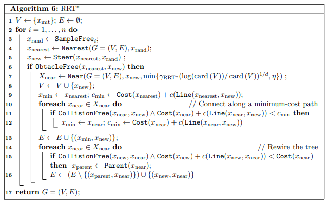

# Motion Planning using RRT and RRT*

## I. Overview :

The goal of this lab project was to explore Sampling based algorithms: RRT and its variants. Through this project, we implemented a binary occupancy grid (0 for free, 1 for occupied), and processed the Hokuyu 2D Lidar scans at a refresh rate of 25ms.

[this](https://www.youtube.com/watch?v=llHCRqwIllM).

### RRT Pseudocode

The pseudocode of the basic version of RRT that we used is listed as above. As for RRT*, we used the pseudocode mentioned below.

### F1TENTH RRT vs. Generic RRT

In general, RRT is often used as a global planner where the tree is kept throughout the time steps. Whenever there is a new obstacle, and the occupancy grid changes, the tree will change accordingly. In our case, RRT is used as a local planner for obstacle avoidance. This is due to the fact that we don't have a well-defined starting point and goal point when we're racing on a track and we want to run continuous laps. In our implementation, we are only keeping a tree for the current time step in an area around the car. You could try to keep one tree that populates the map throughout the time steps, but speed is going to be an issue if you don't optimize how you're finding nodes, and traversing the tree.

For more details, you can check the slides from class for more details on the local planning scheme.

### Implementing an Occupancy Grid

You'll need to implement an occupancy grid for collision checking. Think about what is available to you (the map, the Laserscan messages, etc.), and construct a occupancy grid using those information. You can choose to either implement a binary occupancy grid (a grid cell is either 0 for unoccupied, or 1 for occupied), or use a probabilistic occupancy grid (a grid cell has values between 0 and 1 for probability that it is occupied). You could choose to implement either an occupancy grid in the car's local frame (our recommendation), or in the map's global frame. Depending on the size of the map that you use, think about how to compute updates to the occupancy grid and storing/using the occupancy grid efficiently. Since we're using RRT as a local planner, as in it comes up with a new path at every time step, you need to run everything relatively fast.  You'll also want to visualize the occupancy grid to ensure its correctness. You don't have to implement a multi-layer one like the one shown in the Figure.

Figure 2

### Working in the simulator and on the car

By this point, you should be pretty comfortable using the simulator to test your code. 

### Trajectory Execution

After you've found a path to your goal with RRT, there are different algorithms that you could use to follow that trajectory. 
### Hints

Think about how you could change the way that you're sampling the free space to speed up the process of finding a path to the goal. 

## IV. RRT vs. RRT* 

## References:
https://arxiv.org/pdf/1105.1186.pdf

